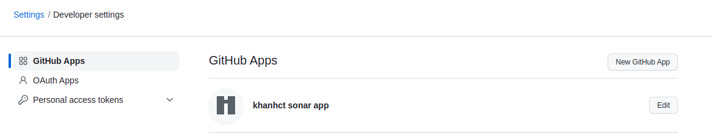
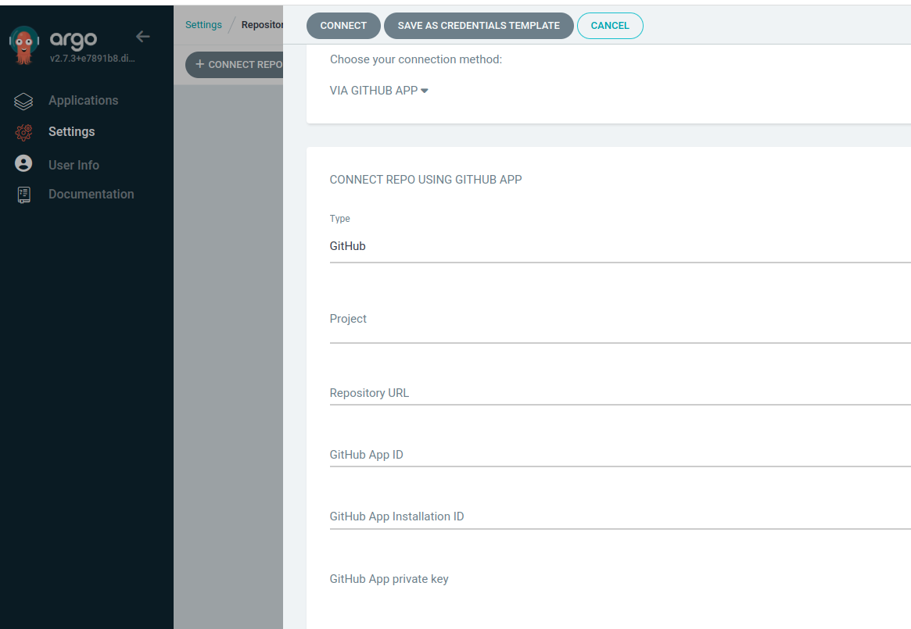
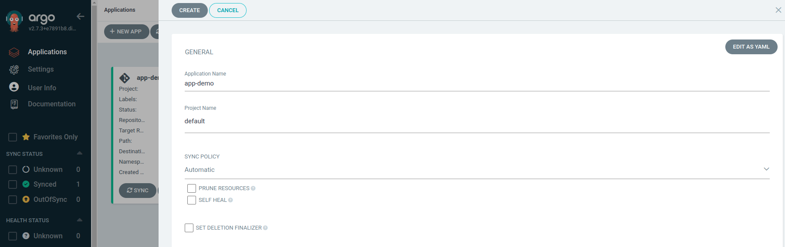
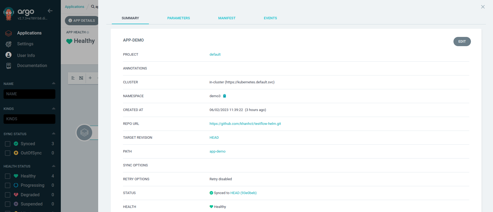

# 1. How to deploy

## Step 1: Install minikube
```sh
wget https://storage.googleapis.com/minikube/releases/latest/minikube-linux-amd64 \
    --quiet \
    --show-progress \
    --output-document=/tmp/minikube-linux-amd64 \
    && sudo install /tmp/minikube-linux-amd64 /usr/local/bin/minikube

# Install kubectl 
$ LATEST=$(wget https://storage.googleapis.com/kubernetes-release/release/stable.txt \
    --quiet \
    --output-document=-) \
    && wget https://storage.googleapis.com/kubernetes-release/release/$LATEST/bin/linux/amd64/kubectl \
    --quiet \
    --show-progress \
    --output-document=/tmp/kubectl \
    && chmod +x /tmp/kubectl \
    && sudo mv /tmp/kubectl /usr/local/bin/kubectl

# Start minikube 
minikube start

# check the kubectl current context
kubectl config current-context

# ping the cluster by listing the namespaces
kubectl get ns
```

### Result
```
NAME              STATUS   AGE
default           Active   2m00s
kube-node-lease   Active   2m00s
kube-public       Active   2m00s
kube-system       Active   2m00s
``` 

## Step 2: Install Argo CD

```sh
# create the namespace
$ kubectl create namespace argocd

# apply the installation manifest
$ kubectl apply \
    --namespace argocd \
    --filename https://raw.githubusercontent.com/argoproj/argo-cd/stable/manifests/install.yaml

# wait for everything to be launched and running
$ watch kubectl get all --namespace argocd
NAME                                     READY   STATUS    RESTARTS   AGE
pod/argocd-application-controller-0      1/1     Running   0          100s
pod/argocd-dex-server-59d44b9f99-8kp7d   1/1     Running   0          100s
pod/argocd-redis-79bdbdf78f-247q5        1/1     Running   0          100s
pod/argocd-repo-server-b6f8cdc6f-4m8h5   1/1     Running   0          100s
pod/argocd-server-bdc697879-rdk89        1/1     Running   0          100s

NAME                            TYPE        CLUSTER-IP      EXTERNAL-IP   PORT(S)                      AGE
service/argocd-dex-server       ClusterIP   10.100.46.74    <none>        5556/TCP,5557/TCP,5558/TCP   100s
service/argocd-metrics          ClusterIP   10.98.170.62    <none>        8082/TCP                     100s
service/argocd-redis            ClusterIP   10.102.83.160   <none>        6379/TCP                     100s
service/argocd-repo-server      ClusterIP   10.96.100.93    <none>        8081/TCP,8084/TCP            100s
service/argocd-server           ClusterIP   10.96.151.61    <none>        80/TCP,443/TCP               100s
service/argocd-server-metrics   ClusterIP   10.102.166.2    <none>        8083/TCP                     100s

NAME                                 READY   UP-TO-DATE   AVAILABLE   AGE
deployment.apps/argocd-dex-server    1/1     1            1           100s
deployment.apps/argocd-redis         1/1     1            1           100s
deployment.apps/argocd-repo-server   1/1     1            1           100s
deployment.apps/argocd-server        1/1     1            1           100s

NAME                                           DESIRED   CURRENT   READY   AGE
replicaset.apps/argocd-dex-server-59d44b9f99   1         1         1       100s
replicaset.apps/argocd-redis-79bdbdf78f        1         1         1       100s
replicaset.apps/argocd-repo-server-b6f8cdc6f   1         1         1       100s
replicaset.apps/argocd-server-bdc697879        1         1         1       100s

NAME                                             READY   AGE
statefulset.apps/argocd-application-controller   1/1     100s

```

## Step 3 Access Argo CD
### Change svc/argocd-server to NodePort and access via Node Port
```sh
kubectl patch svc -n argocd argocd-server --patch '{"spec": {"type": "NodePort"}}'
```

### or using port-forward 
```sh
kubectl -n argocd port-forward --address='0.0.0.0' service/argocd-server 443:443
```

### How to get account infomarion 
```sh
# Username: admin
# get admin password
kubectl get secret argocd-initial-admin-secret \
    --namespace argocd \
    --output jsonpath="{.data.password}" \
    | base64 --decode \
    && echo
```
Access to  https://localhost

# 2. Deploy test app
## Step 1: Create github app
Access **Settings/Developer settings** and create a new github app 
</br>



## Step 2 Connect to private github repo 
Access **Settings/Repositories** and connect repo 

</br>



### Result:


## Step 3: New argocd app


### Result:


